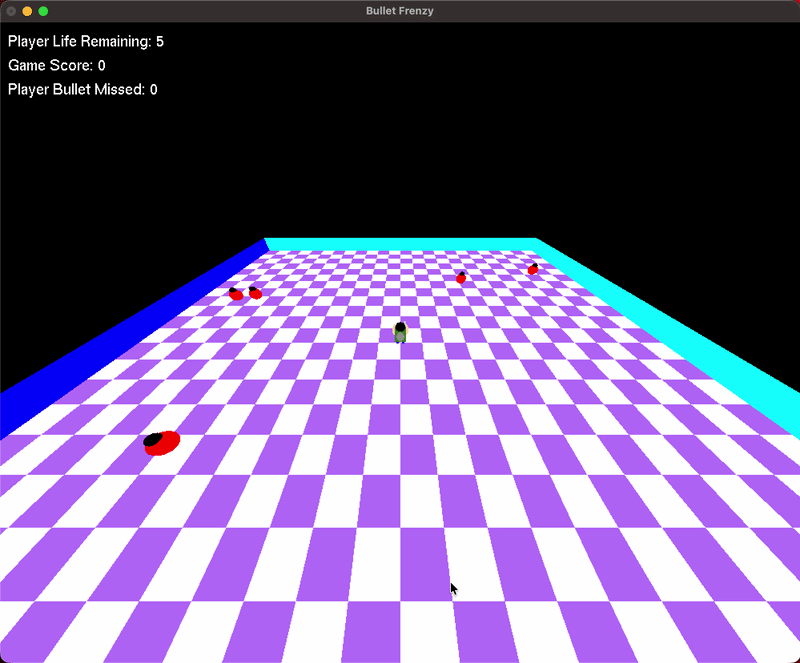

# Bullet Frenzy

A **3D OpenGL shooting game** built with **Python + PyOpenGL (GLU / GLUT)** where the player controls a fully composite 3D character — built from spheres, cylinders, and cuboids — who rotates, fires cube-shaped bullets, and survives waves of pulsing sphere enemies on a dynamically generated grid, all viewed through a switchable first-person / third-person perspective camera.

---

## Gameplay
<p>
  
</p>

The player spawns at the center of a checkered grid floor. Enemies continuously home in on the player from all directions — get too close and you lose a life. Aim the gun and fire bullets to destroy enemies before they reach you, but watch your miss count: 10 missed bullets ends the game just as surely as running out of lives.

---

## Features

| Feature | Description |
|---|---|
| **Composite Player Model** | Built entirely from primitives — cuboid body, sphere head, scaled-sphere arms, cylinder legs, sphere backpack, and a cuboid gun — assembled with hierarchical transformations |
| **Two-Sphere Enemies** | Each enemy is built from two spheres (body + head) and continuously pulses in scale while tracking the player |
| **Enemy AI Pursuit** | All 5 enemies constantly move toward the player's current position; touching the player costs a life and respawns the enemy far away |
| **Bullet System** | Cube-shaped bullets travel along the gun's fired angle and are removed once they leave the grid boundary, incrementing the miss counter |
| **Dual Camera Modes** | Third-person orbit camera (adjustable height & angle) and first-person camera locked to the gun/player angle, toggled with the right mouse button |
| **Cheat Mode** | Auto-rotates the gun a full 360° and auto-fires whenever an enemy enters a line-of-sight cone — reuses the same fire/rotate functions as manual play |
| **Cheat Vision** | While cheat mode is active, locks the first-person camera to follow the auto-aiming gun angle instead of the manual angle |
| **Dynamic Grid & Boundaries** | The checkered floor and four color-coded vertical boundary walls are generated procedurally with loops — nothing is hardcoded |
| **Live HUD** | On-screen counters for remaining life, score, and missed bullets, updated every frame |
| **Game Over & Restart** | Player model falls flat when life hits 0 or misses reach 10; pressing `R` resets all state instantly |

---

## Controls

| Input | Action |
|---|---|
| `W` / `S` | Move player forward / backward |
| `A` / `D` | Rotate gun left / right |
| Left Click | Fire bullet |
| Right Click | Toggle first-person / third-person camera |
| `↑` / `↓` | Adjust camera height |
| `←` / `→` | Orbit camera angle around the arena |
| `C` | Toggle cheat mode (auto-aim + auto-fire) |
| `V` | Toggle cheat vision (camera follows the gun) |
| `R` | Restart game |

---

## How It Works

### Perspective Projection & Camera Setup

Every frame rebuilds the projection and view matrices from scratch. `gluPerspective` defines the view frustum, and `gluLookAt` is computed differently depending on camera mode — orbiting around the player in third-person, or sitting just behind the gun in first-person:

```python
def setup_camera():
    glMatrixMode(GL_PROJECTION); glLoadIdentity()
    gluPerspective(fovY, 1.25, 0.1, 1500)
    glMatrixMode(GL_MODELVIEW); glLoadIdentity()
    if camera_mode == "third":
        cx = player_pos[0] + math.cos(math.radians(cam_angle)) * 300
        cy = player_pos[1] + math.sin(math.radians(cam_angle)) * 300
        gluLookAt(cx, cy, cam_height,
                  player_pos[0], player_pos[1], player_pos[2], 0, 0, 1)
    else:
        la = manual_angle if (cheat_mode and not cheat_vision) else gun_angle
        cx = player_pos[0] - math.cos(math.radians(la)) * 10
        cy = player_pos[1] - math.sin(math.radians(la)) * 10
        cz = player_pos[2] + 80
        gluLookAt(cx, cy, cz,
                  cx + math.cos(math.radians(la))*100,
                  cy + math.sin(math.radians(la))*100,
                  cz - 20, 0, 0, 1)
```

### Composite Character Modeling

The player and enemies are never single shapes — they're hierarchies of primitives assembled with `glPushMatrix()` / `glPopMatrix()`, each part translated, rotated, and scaled relative to a shared origin:

```python
glPushMatrix(); glColor3f(0.3, 0.5, 0.2)
glTranslatef(0, 0, 20); glScalef(0.8, 1.2, 1.6); glutSolidCube(15); glPopMatrix()   # Body
glPushMatrix(); glColor3f(0, 0, 0)
glTranslatef(0, 0, 36); gluSphere(quadric, 8, 20, 20); glPopMatrix()               # Head
```

Each limb, the backpack, and the gun follow the same pattern — push, transform, draw, pop — so nesting a whole character under a single outer `glTranslatef`/`glRotatef` (for position and facing direction) moves every part together.

### Dynamic Grid Generation

The floor and boundary walls are never hardcoded — the checkerboard is produced by nested loops over a fixed `step` size, alternating colors based on tile parity, and the four boundary walls are drawn from a loop over their corner coordinates and colors:

```python
step = 50
for x in range(-GRID_LENGTH, GRID_LENGTH, step):
    for y in range(-GRID_LENGTH, GRID_LENGTH, step):
        glColor3f(1,1,1) if ((x//step)+(y//step))%2==0 else glColor3f(0.7,0.5,0.95)
        glVertex3f(x,y,0); glVertex3f(x+step,y,0)
        glVertex3f(x+step,y+step,0); glVertex3f(x,y+step,0)
```

### Cheat Mode Logic

Cheat mode doesn't introduce any new drawing or firing code — it reuses the existing `fire_bullet()` function and gun-rotation logic behind a flag. Each idle tick, the gun angle auto-increments, and once a cooldown expires, every enemy's bearing from the player is compared against the current gun angle; a match within a 15° cone triggers a shot and resets the cooldown:

```python
gun_angle = (gun_angle + 5) % 360
cheat_cooldown -= 1
if cheat_cooldown <= 0:
    for enemy in enemies:
        dx = enemy['pos'][0] - player_pos[0]
        dy = enemy['pos'][1] - player_pos[1]
        diff = (math.degrees(math.atan2(dy, dx)) - gun_angle) % 360
        if diff > 180: diff -= 360
        if abs(diff) < 15:
            fire_bullet(); cheat_cooldown = 20; break
```

### Bullet–Enemy–Player Collision

Rather than bounding boxes, collisions use simple circular distance checks each frame — a bullet within 25 units of an enemy scores a hit, and an enemy within 20 units of the player costs a life:

```python
dx = b['pos'][0]-enemy['pos'][0]; dy = b['pos'][1]-enemy['pos'][1]
if math.sqrt(dx**2+dy**2) < 25:
    score += 10; enemy['pos'] = spawn_far()
```

---

## How to Run

### Requirements

```bash
pip install PyOpenGL PyOpenGL_accelerate
```

> On macOS you may also need: `brew install freeglut`
> On Linux: `sudo apt-get install freeglut3-dev`

### Run

1. Download the **bullet_frenzy.py** file
2. Make sure PyOpenGL is installed in your environment
3. Run it from a terminal

```bash
python3 bullet_frenzy.py
```

---

## Project Structure

```
bullet-frenzy-opengl/
├── bullet_frenzy.py         # Full game — 3D transformations, camera, cheat AI, and GLUT loop
├── screenshots/
│   ├── gameplay.png         # Static screenshot of running game
│   └── gameplay.gif         # (add your screen recording here)
└── README.md
```

---

## Technical Architecture

- **Language:** Python 3.x
- **Graphics API:** OpenGL via PyOpenGL + GLU/GLUT (freeglut)
- **Projection:** Perspective projection (`gluPerspective`) with two switchable `gluLookAt` camera configurations
- **Rendering Primitives:** GLU quadrics (`gluSphere`, `gluCylinder`) and GLUT solids (`glutSolidCube`) exclusively — no external models
- **Coordinate System:** 3D world space with hierarchical modelview transformations (`glPushMatrix` / `glPopMatrix`) for nested composite objects
- **Animation:** `glutIdleFunc` main loop driving bullet travel, enemy pursuit, pulsing enemy scale, and cheat-mode auto-aim

## Core Engineering Practices Demonstrated

- **Composite Object Modeling:** The player and enemies are assembled entirely from primitive shapes (spheres, cylinders, cuboids) using nested matrix transformations rather than any pre-built models
- **Dual Perspective Camera System:** One `setup_camera()` function branches between an orbiting third-person view and a gun-relative first-person view, computed fresh every frame from `player_pos`, `cam_angle`, and `gun_angle`
- **Procedural Environment Generation:** The grid floor and its four boundary walls are generated entirely through loops over coordinates and parity-based coloring — zero hardcoded geometry
- **Reusable Action Functions:** Cheat mode introduces no new firing or rotation code — it drives the same `fire_bullet()` and angle-update logic used for manual play, gated by a state flag and cooldown timer
- **Line-of-Sight Targeting:** Auto-fire logic computes the bearing from player to each enemy via `atan2`, normalizes the angular difference, and checks it against a threshold cone relative to the current gun angle
- **Distance-Based Collision Detection:** Bullet-enemy and enemy-player interactions are resolved with simple Euclidean distance thresholds, checked every frame in the idle loop
- **State Machine Game Logic:** Game state (`game_over`, `cheat_mode`, `cheat_vision`, `camera_mode`) cleanly separates rendering, input handling, and the physics/AI update step
- **Continuous Procedural Animation:** Enemy scale oscillates between bounds each frame by flipping a direction multiplier — a simple, self-contained pulsing effect with no external animation library

## Author

**Md. Tanvirul Islam Rifat**

* **GitHub:** [@tanvirul-islam-rifat](https://github.com/tanvirul-islam-rifat)
* **LinkedIn:** [Tanvirul Islam Rifat](https://www.linkedin.com/in/tanvirul-islam-rifat)
